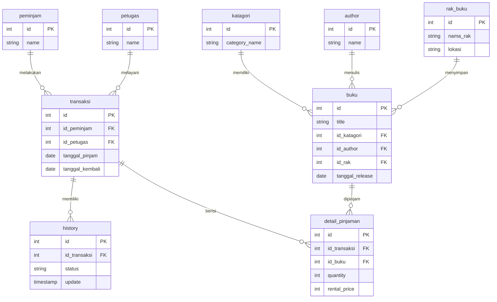

# Entitas dan Penjelasan

## 1. Buku
Menyimpan informasi mengenai buku yang tersedia di perpustakaan.

Atribut:
- id (PK) → Primary Key
- title → Judul buku
- id_katagori (FK) → Relasi ke tabel kategori
- id_author (FK) → Relasi ke tabel author
- tanggal_release → Tanggal rilis buku

Relasi:
- Satu buku memiliki satu kategori
- Satu buku ditulis oleh satu author
- Satu buku disimpan dalam satu rak
- Satu buku dapat dipinjam berkali-kali melalui transaksi

---

## 2. Kategori
Menyimpan jenis atau klasifikasi buku.
Atribut:
- id (PK)
- category_name

Relasi:
- Satu kategori dapat memiliki banyak buku (1:N)

---

## 3. Author
Menyimpan data penulis buku.

Atribut:
- id (PK)
- name

Relasi:
- Satu author dapat menulis banyak buku (1:N)

---

## 4. Rak Buku
Menyimpan informasi lokasi penyimpanan buku.

Atribut:
- id (PK)
- nama_rak

Relasi:
- Satu rak dapat menyimpan banyak buku (1:N)

---

## 5. Peminjam
Menyimpan data anggota perpustakaan yang dapat meminjam buku.

Atribut:
- id (PK)
- name

Relasi:
- Satu peminjam dapat melakukan banyak transaksi (1:N)

---

## 6. Petugas
Menyimpan data pegawai perpustakaan yang melayani transaksi.

Atribut:
- id (PK)
- name

Relasi:
- Satu petugas dapat melayani banyak transaksi (1:N)

---

## 7. Transaksi
Menyimpan data peminjaman buku.

Atribut:
- id (PK)
- id_buku (FK) → Relasi ke buku
- id_peminjam (FK) → Relasi ke peminjam
- id_petugas (FK) → Relasi ke petugas
- tanggal_pinjam
- tanggal_kembali

Relasi:
- Satu transaksi berkaitan dengan satu buku
- Satu transaksi dilakukan oleh satu peminjam
- Satu transaksi dilayani oleh satu petugas
