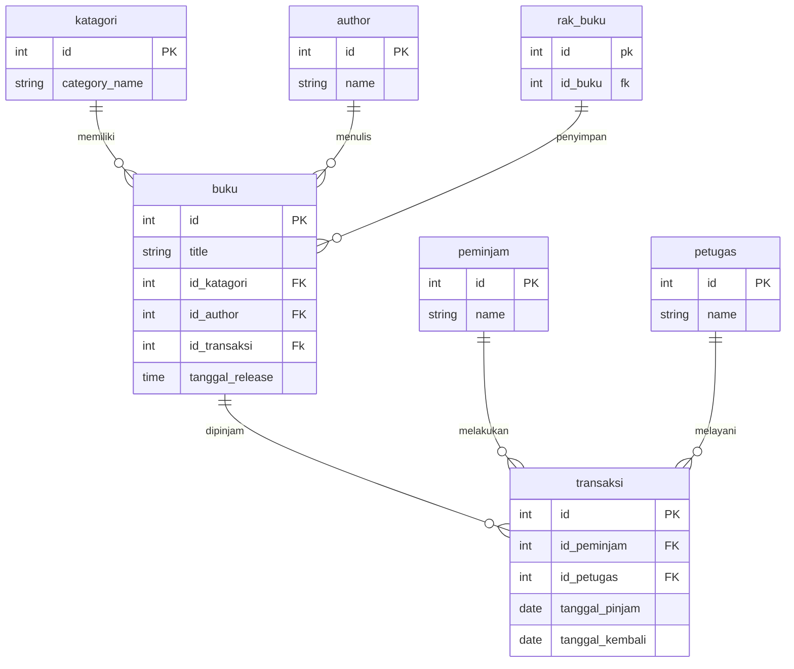

```mermaid
erDiagram
        transaksi {
        int id PK
        int id_peminjam FK
        int id_petugas FK
        date tanggal_pinjam
        date tanggal_kembali
    }


    buku {
        int id PK
        string title
        int id_katagori FK
        int id_author FK  
        int id_transaksi Fk      
        time tanggal_release
    }

    katagori {
        int id PK
        string category_name
    }

    peminjam {
        int id PK
        string name
    }

    author {
        int id PK
        string name
    }
    rak_buku {
        int id pk
        int id_buku fk
    }
      petugas {
        int id PK
        string name
    }

    katagori ||--o{ buku : memiliki
    author ||--o{ buku : menulis
    rak_buku ||--o{ buku : penyimpan

    buku ||--o{ transaksi : dipinjam
    peminjam ||--o{ transaksi : melakukan
    petugas ||--o{ transaksi : melayani

```
